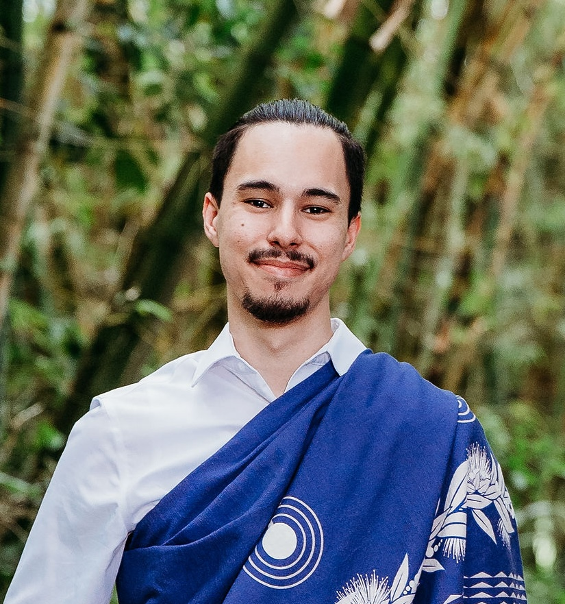

  
  <h3> Enabling Cyber Autonomy Through Trustworthy AI </h3>

#### Abstract

Modern society depends on complex software systems that are widely used yet understood and controlled by only a small number of experts. As recent large-scale failures and security incidents illustrate, this imbalance leaves users and critical infrastructure fragile in the face of software failures and wide-scale exploitation. With software systems continuing to grow in size and complexity, these risks are increasing.

To address this challenge, we must re-empower users with meaningful autonomy over the software they rely on. Doing so requires scalable cyber automation that enables users to understand, secure, and repair software independently. Recent advances in artificial intelligence offer a promising path forward, but only if such systems are trustworthy, grounded in verified information, scalable to real-world code, and useful to humans.

In this talk, I present my research on enabling cyber autonomy through trustworthy AI-driven security automation. I first describe systems that combine large language models with traditional program analyses to automatically discover and repair vulnerabilities, including previously unknown flaws in real-world open-source software. I then discuss how grounding and scaling these techniques to large, unseen codebases is critical for reliability. Finally, I explore how these methods extend beyond full automation to human-centered settings, where AI tools help individuals understand and reason about third-party software.

#### Bio

Zion Leonahenahe Basque is a PhD candidate at Arizona State University whose research sits at the intersection of program analysis and artificial intelligence. For the past two years, he has led the autonomous vulnerability patching group for Team Shellphish in DARPA's AIxCC, where the team placed 5th, earned $3 million in awards, and autonomously discovered multiple vulnerabilities in real-world open-source software. Underpinning his work is a deep commitment to understanding software and building community. He founded the Workshop on Software Understanding and Reverse Engineering (SURE), co-located with CCS, and aims to make software easier to understand and fix for everyone.

 
